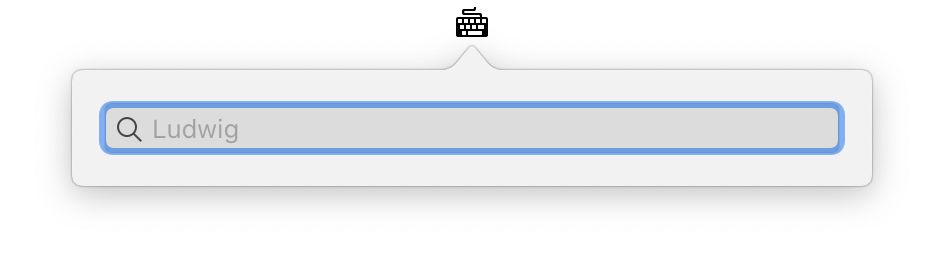

  
  <h1 align="center">Ludwigx</h1>
  

    Minimal Ludwig app in macOS menu bar without limitation.
     
    <a href="https://ludwig.guru">https://ludwig.guru</a>
     
     
    
  

  <h3 align="center">Installation</h3>
  

    Download <a href="https://github.com/thang-nm/Ludwigx/releases">here</a> → Extract → Move to <strong>Applications</strong> → Enjoy!
     
    <strong>OR</strong>
     
    Build your own from this project.
     
     
    This app doesn't have a signature, so you need to do <a href="http://osxdaily.com/2016/09/27/allow-apps-from-anywhere-macos-gatekeeper">this</a> to run this app.
     
     
    Thank <a href="https://www.deviantart.com/1dohcouk/art/Typewriter-324969277">@1dohcouk</a> for the icon!
  

